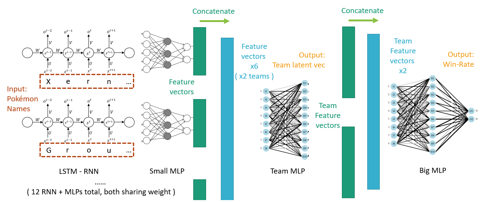
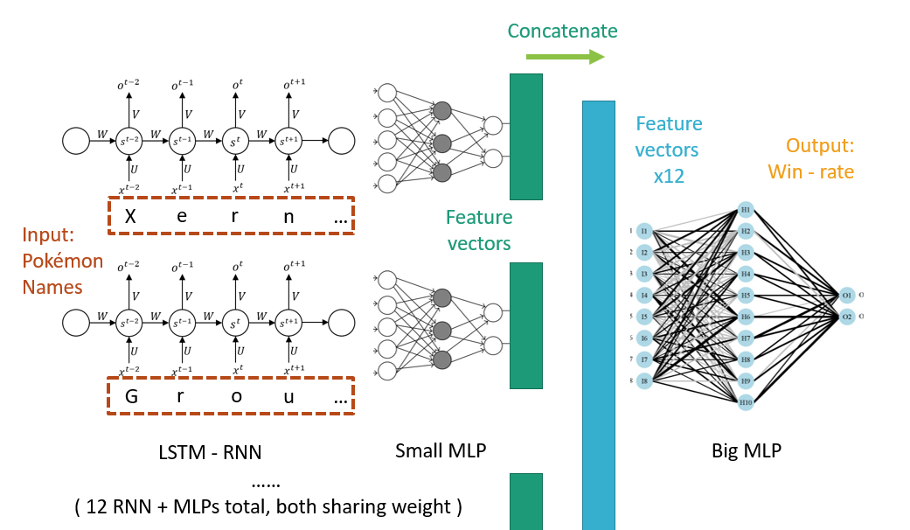

# Pokemon Showdown Win Rate Prediction

This is an simple model predicts win-rate for pokemon (showdown) matches.  
**WORK IN PROGRESS**

## Requirements ( latest should work )
* python 3.6  
* tensorflow  
* tensorlayer  
* termcolor (used to print out pretty logs)

## Usage (v2)
### Get match data

`python spider.py [tierName]`  

e.g.

`python spider.py gen7vgc2019sunseries`

### Convert raw data to embedded data

`python convertRaw.py [filename] (-max maxSpecies)`

e.g.

`python convertRaw.py gen7ou.txt`

### Train the model

`python trainv2.py [formatPrefix (data file name without .txt)]`

Please use -h option to print the help message for more options.  
Note: -fmt & -load is not working now.

### Notes

Currently accuracy is about 60% (best performance).  
maxpool is better than summation (might for classification problems).

## Usage (legacy version)

**Accuracy recalculating**  
It seems that it is **no better than random guess** (acc 50%).  
I'm very sorry for this mistake.  
Reason: tf.metrics.accuracy just messed up my training acc and validation acc by calculating all history accuracy. I don't know that although I found it was weird...I don't even thought about it...OMG.

v2 version don't have this problem.  
current best accuracy on validation set is **61.9%** (v2 model).

### Train the model

`python simpleToy.py [Train_data_path(.txt)] [Test_data_path(.txt)] [parameters]`

Available parameters:

Parameter Short hand | Usage | Comments
---|---|---
-gpu | -gpu 0,1,2 | Use selected GPU(s)
-ep | -ep 1000 | Total epochs
-bs | -bs 32 | Minibatch batch size
-maxl | -maxl 20 | Max length of pokemon name ( used for padding and cut too long names out )
-hu | -hu 128 | Hiiden state size for RNNs
-pu | -pu 128 | Latent vector size for each Pokemon
-thu | -thu 256 | Latent vector size for each Team
-big | -big | Directly predict results from 12 Pokemon vectors instead of 2 Team vectors, using a BIG model. ( No parameters )
-fmt | -fmt ou | Filename used to store trained model weights when training ends. File will be saved as ./modelFiles/[format].ckpt
-load | -load modelFiles/ou.ckpt | Load saved model weights (.ckpt), could combine with -fmt to restore training state and save again.

e.g.  
`python simpleToy.py dataset\train_vgcSun.txt dataset\test_vgcSun.txt -gpu 0 -pu 128 -thu 256 -bs 64 -ep 600 -fmt vgc_team_dropout`

### Use the model to predict results

`python predict.py [parameters]`

Parameters same as above.  
However, one **must** load a saved weight file (.ckpt) in order to get reasonable results.  

e.g.  
`python predict.py -gpu 0 -pu 128 -thu 256 -load modelFiles/vgc_team_dropout.ckpt`

**NOTE:**  
When input team members for each side, one **must**:  
* Use Pokemon Showdown offical names (name shown in game) with forms (-Wash, -Therian etc.)
* Don't add -Mega for mega Pokemons
* Use comma to separate them
* DO NOT add extra white spaces around comma
* ADD a EXTRA COMMA at the end of input.

e.g.  
`Rotom-Wash,Bronzong,Incineroar,Groudon,Venusaur,Xerneas,`

## Details  

### Team model ( without -big )

( There are 2 team MLP networks sharing weights. )

### Big model ( -big )

### Structures

Network | Structure
--- | ---
Input RNN | Single layer LSTM Dropout, keep = 0.7
Pokemon MLP | Input - 128 - 128 - output Dropout, keep = 0.7, only for output
Team MLP | Input - 512 - 512 - 256 - output Dropout for last 2 layers, keep = 0.8 for layer3 & keep = 0.7 for layer4
Big MLP (w/o -big) | Input - 512 - 256 - 128 - output Dropout for layer2 & layer3, keep = 0.8 & 0.7, respectively
Big MLP (with -big) | Input - 1024 - 512 - 512 - 256 - output Dropout for layer 2, 3 & 4, keep = 0.8, 0.8, 0.7, respectively

All MLPs has a Batch Normalization layer before activation.  
The last layer of both Big MLPs has Sigmoid activation, Other layers have 0.2 leakyRelu.

## Misc

**Accurancy recalculating**  
It seems that it is **no better than random guess** (acc 50%).  
I'm very sorry for this mistake.  
Reason: tf.metrics.accurancy just messed up my training acc and validation acc by calculating all history accurancy. I don't know that although I found it was weird...I don't even thought about it...OMG.

**Predicting Philadelphi Regional Masters Finals:**  

Ground truth Result | Team | Prediction
---|---|---
WON|Kyogre, Yveltal, Tapu Lele, Incineroar, Stakataka, Toxicroak|**6.18%  ~ 12.67%**
LOST|Tapu Fini, Incineroar, Kyogre, Ferrothorn, Ho-Oh,  Ludicolo|**87.33% ~ 93.82%**

lol and congratulations to Justin Brains!  
